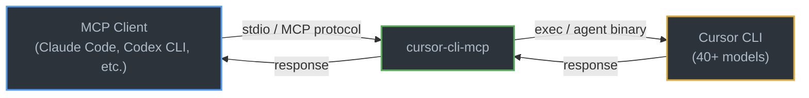

# cursor-cli-mcp

**Use every model in your Cursor subscription from any AI agent. No API keys needed.**

An [MCP (Model Context Protocol)](https://modelcontextprotocol.io) server that bridges any MCP-compatible tool to Cursor's full model roster — GPT-5.x, Claude 4.x, Gemini 3.x, Grok, and more — using your existing Cursor subscription credits.

## Why?

AI coding agents like Claude Code, Codex CLI, and others are powerful — but they're locked to a single model provider. Meanwhile, your Cursor subscription gives you access to **40+ models** across OpenAI, Anthropic, Google, and others.

**cursor-cli-mcp** bridges this gap. It lets any MCP-compatible agent call any Cursor model as a tool, using your subscription. No API keys, no separate billing, no rate limits beyond your plan.

### The value

| Without cursor-cli-mcp | With cursor-cli-mcp |
|------------------------|---------------------|
| Each model needs its own API key | Zero API keys — use your Cursor subscription |
| Separate billing per provider | One subscription covers all models |
| Rate limits per API | Use your existing Cursor allowance |
| Locked to one model per agent | Switch models per-task from any agent |

## What you get

| Tool | Description |
|------|-------------|
| `cursor_prompt` | Send any prompt to any Cursor model and get a response |
| `cursor_review` | Code review using any model — checks bugs, security, performance, quality |
| `cursor_review_file` | Review a file by path using any model |
| `cursor_list_models` | List all models available in your subscription |

## Prerequisites

1. **Cursor** installed with an active subscription ([cursor.com](https://cursor.com))
2. **Cursor CLI agent** installed at `~/.local/bin/agent` (Cursor installs this automatically — run `cursor` from terminal to verify)
3. **Node.js** >= 18

> **Custom agent path?** Set the `CURSOR_AGENT_PATH` environment variable to override the default location.

## Install

### Option 1: npx (no install)

Use directly in your MCP config — no global install needed:

```json
{
  "mcpServers": {
    "cursor-cli": {
      "command": "npx",
      "args": ["-y", "cursor-cli-mcp"]
    }
  }
}
```

### Option 2: Global install

```bash
npm install -g cursor-cli-mcp
```

Then reference it in your MCP config:

```json
{
  "mcpServers": {
    "cursor-cli": {
      "command": "cursor-cli-mcp"
    }
  }
}
```

### Option 3: From source

```bash
git clone https://github.com/MazRadwan/cursor-cli-mcp.git
cd cursor-cli-mcp
npm install
```

```json
{
  "mcpServers": {
    "cursor-cli": {
      "command": "node",
      "args": ["/path/to/cursor-cli-mcp/index.js"]
    }
  }
}
```

## Setup by client

### Claude Code

```bash
claude mcp add cursor-cli -- npx -y cursor-cli-mcp
```

Or add to your project `.mcp.json`:

```json
{
  "mcpServers": {
    "cursor-cli": {
      "command": "npx",
      "args": ["-y", "cursor-cli-mcp"]
    }
  }
}
```

### Codex CLI

Add to your MCP configuration:

```json
{
  "mcpServers": {
    "cursor-cli": {
      "command": "npx",
      "args": ["-y", "cursor-cli-mcp"]
    }
  }
}
```

### Any MCP-compatible client

cursor-cli-mcp uses **stdio transport** — it works with any client that supports the MCP standard. Just point your client's MCP server config to `npx -y cursor-cli-mcp` or the installed binary.

## Use cases

### Cross-model code review

Use Claude Code as your primary agent, but send reviews to GPT-5.4 or Gemini for a second opinion:

```
"Review this auth module for security issues"
→ cursor_review_file({ file_path: "/src/auth.ts", model: "gpt-5.4-high" })
```

### Model comparison

Test the same prompt across different models to compare outputs:

```
→ cursor_prompt({ prompt: "Explain this regex: ...", model: "gpt-5.4-high" })
→ cursor_prompt({ prompt: "Explain this regex: ...", model: "sonnet-4.6-thinking" })
```

### Overflow / fallback

When your primary agent's API hits rate limits or quota, route to Cursor as a fallback without changing your workflow.

### Specialized tasks

Route tasks to the best model for the job:

- **Deep reasoning** → `opus-4.6-thinking`
- **Fast iteration** → `gpt-5.4-high-fast`
- **Code generation** → `gpt-5.3-codex-high`
- **Planning** → `sonnet-4.6-thinking`

## Available models

Run `cursor_list_models` to see your full list. Typical subscriptions include:

- **OpenAI**: GPT-5.4, GPT-5.3 Codex, GPT-5.2, GPT-5.1
- **Anthropic**: Claude 4.6 Opus, Claude 4.6 Sonnet, Claude 4.5
- **Google**: Gemini 3.1 Pro, Gemini 3 Pro, Gemini 3 Flash
- **Others**: Grok, Kimi K2.5, and more

Model availability depends on your Cursor subscription tier.

## Configuration

| Environment variable | Default | Description |
|---------------------|---------|-------------|
| `CURSOR_AGENT_PATH` | `~/.local/bin/agent` | Path to the Cursor CLI agent binary |

## How it works



1. Your MCP client sends a tool call over stdio
2. cursor-cli-mcp translates it into a Cursor CLI agent invocation
3. Cursor routes to the requested model using your subscription
4. Response flows back through the same path

## Contributing

Contributions welcome! Please open an issue or PR.

## License

See [LICENSE](LICENSE) for details.
